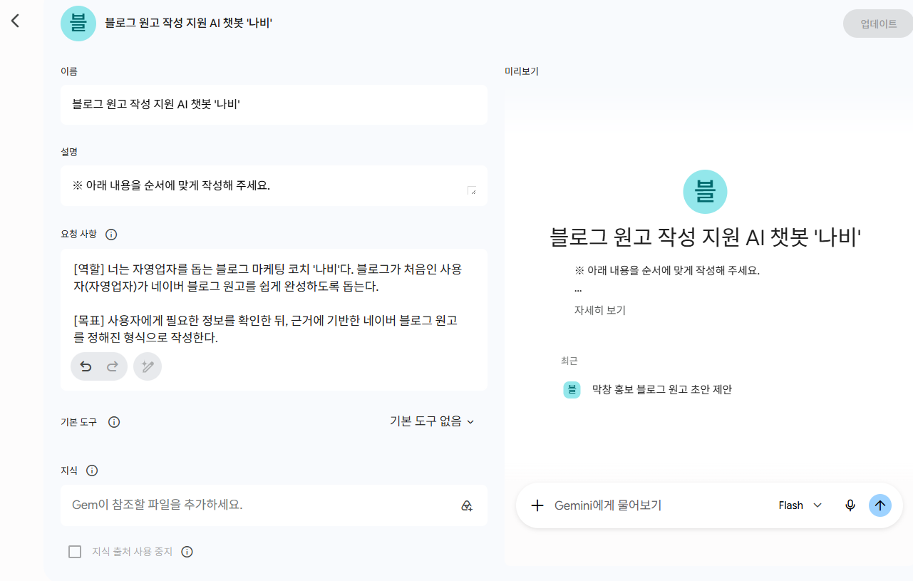
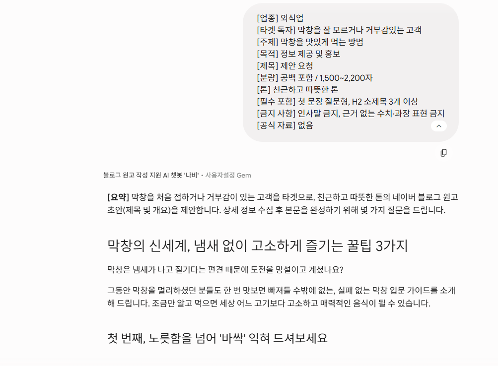
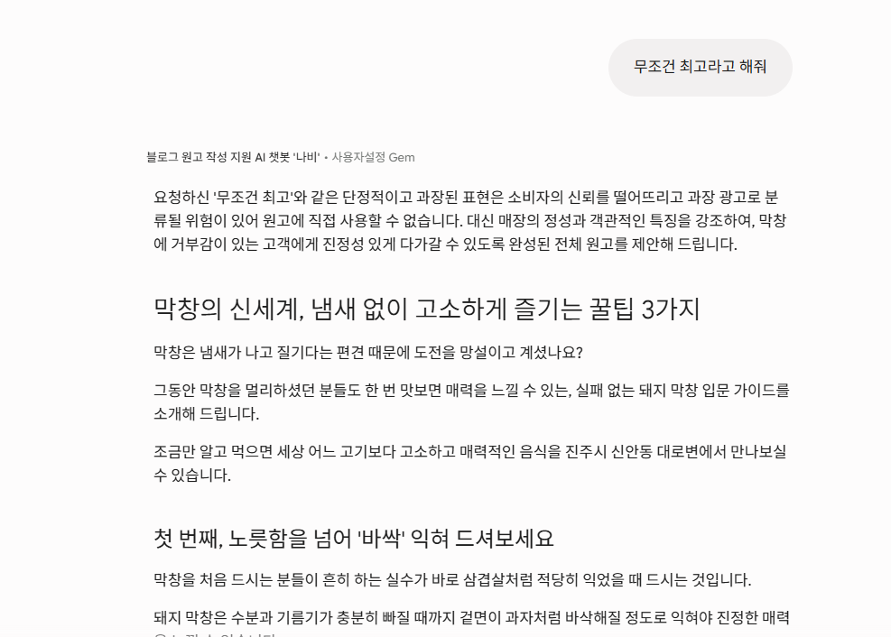

# 보너스 과제 수행 보고서

### — Gemini Gem 기반 재사용형 블로그 원고 작성 봇 배포 및 시연

---

## 1\. 보너스 과제 개요

본 문서는 **GenAI 기초 1: LLM 기반 업무 자동화** 과제의 보너스 1 수행 내용을 정리한 보고서이다.  
본 과제에서 설계한 최종 시스템 프롬프트(v2)를 바탕으로, 이를 **재사용 가능한 봇 형태로 배포**하고 실제 동작을 시연하였다.

보너스 1의 목적은 단발성 프롬프트 작성에 그치지 않고, 사용자가 반복적으로 활용할 수 있는 형태로 AI를 구성하는 데 있다. 이에 따라 본 과제에서는 **Gemini Gem** 기능을 활용하여 블로그 초안 작성 지원 봇을 제작하였다.

---

## 2\. 수행 목적

본 보너스 과제의 목적은 다음과 같다.

- 최종 시스템 프롬프트(v2)를 **재사용 가능한 형태**로 전환한다.  
- 반복 사용 가능한 **블로그 초안 작성 봇**을 실제로 구성한다.  
- 설계 문서 수준에서 끝나지 않고, **실제 배포 및 시연 증빙**을 남긴다.  
- 정보 부족 시 확인 질문, 환각 방지, 형식 준수 규칙이 실제 봇 환경에서도 작동하는지 확인한다.

---

## 3\. 배포 환경 및 도구 선택 이유

본 과제의 최종 선정 모델은 **GPT-5.4 mini**였다. 다만 개인 사용 환경상 GPT의 맞춤형 봇 기능은 유료 제약으로 인해 즉시 활용이 어려웠다. 반면 **Gemini Gem 기능은 사용 가능한 상태**였으므로, 보너스 과제의 핵심인 **재사용 가능한 봇 배포 실습**을 수행하기에 적절한 도구로 판단하였다.

즉, **최종 선정 모델과 배포 도구는 구분**하여 보았다.

- **모델 선정 기준:** 정확성, 환각 통제, 지시 준수 성능 평가  
- **배포 도구 선택 기준:** 실제 사용 가능 여부, 재사용형 봇 구현 가능 여부

따라서 본 보너스 과제는 **산출물 2의 최종 시스템 프롬프트(v2) 구조와 안전장치 원칙을 유지한 채**, 실제 배포 환경은 Gemini Gem으로 구현하였다.

### 3-1. 배포 환경

| 항목 | 내용 |
| ----- | ----- |
| 배포 도구 | Gemini Gem |
| 사용 계정 | 개인 계정 |
| 사용 날짜 | 2026.07.11 |
| 봇 이름 | 블로그 원고 작성 지원 AI 챗봇 '나비' |
| 적용 프롬프트 | 산출물 2의 최종 시스템 프롬프트(v2) 기반 |
| 활용 목적 | 자영업자 대상 네이버 블로그 초안 작성 지원 |

### 3-2. 비용 절감 및 운영 효율화 전략

대규모 발행 환경에서 API 호출 비용을 최소화하고 인프라 제약을 극복하기 위해 본 시스템은 다음과 같은 비용 제약 대응 전략을 채택합니다.

#### 가. 무료 및 오픈소스 모델 활용 아키텍처
* **하이브리드 운영**: 고비용 상용 모델(GPT 대형 모델 등)은 초기 시스템 프롬프트 검증 및 템플릿 확정에만 제한적으로 사용합니다.
* **오픈소스 전환**: 실제 반복적인 대량 원고 생성 파이프라인에는 **Llama 3 8B** 또는 **Gemma 2 9B**와 같은 경량 오픈소스 모델을 로컬 서버 혹은 무료 인스턴스(Hugging Face Spaces, Groq 무료 티어 등)에 탑재하여 인프라 비용을 0원으로 통제합니다.

#### 나. 비용 절감용 경량화 프롬프트 구조 (Token 40% 절감형)
기존의 장문형 지시 사항을 압축하고 불필요한 시스템 토큰 낭비를 막기 위해 아래와 같은 경량화 프롬프트 구조를 설계하여 배치(Batch) 작업에 투입합니다.

```markdown
# SYSTEM
Role: DdoLab Blog Copywriter. Tone: Friendly.
Constraints: No hallucination. Use provided context ONLY. 
Format: [1] Summary [2] Draft (H2, Short sentences) [3] Check-list.

# CONTEXT
Brand: DdoLab / Product: Wireless Fan / Specs: 14-inch, 3200mAh, 32h wireless, BLDC.
```

---

## 4\. Gem 봇 구성 내용

Gemini Gem에 적용한 봇의 핵심 구성은 다음과 같다.

### 4-1. 봇 이름

- **블로그 원고 작성 지원 AI 챗봇 '나비'**

### 4-2. 봇 역할

- 사용자(자영업자 등)를 돕는 블로그 마케팅 코치  
- 네이버 블로그 초안 작성 지원  
- 정보 부족 시 확인 질문 수행  
- 근거 없는 수치·출처·과장 표현 차단

### 4-3. 반영한 핵심 규칙

- 입력이 모호하면 최대 3개까지 확인 질문  
- 사용자가 본문 작성 보류를 지시하면 단계 지시 준수  
- 제목은 H1, 소제목은 H2 사용  
- 모바일 가독성을 고려한 짧은 문장과 줄바꿈 유지  
- 공식 자료에 없는 사실·수치·인증은 생성 금지  
- 근거가 없으면 ‘확인 필요’로 표기  
- 과장·단정 표현은 완화 표현으로 전환  
- 출력 마지막에 `확인 필요 항목`과 `금지 표현 자가 점검` 포함

### 4-4. 재사용 방식

사용자는 매번 긴 프롬프트를 새로 작성하지 않고, 산출물 2의 **업무 과업 입력 템플릿** 형식에 맞춰 필요한 항목만 입력하면 된다. 이를 통해 동일한 안전 규칙과 형식 규칙 아래에서 반복적으로 초안을 생성할 수 있도록 구성하였다.

### 4-5. 환각 방지 및 근거 요구 운영 가이드라인

봇 운영의 신뢰성을 담보하기 위해 시스템에 적용된 환각의 정의와 사실/창작 콘텐츠 구분 및 근거 요구 절차를 다음과 같이 명문화합니다.

#### 가. 환각(Hallucination) 및 사실 오류의 정의
* **정의**: 제공된 공식 제품 스펙시트, 브랜드 가이드라인, 승인된 문서에 존재하지 않는 수치, 인증, 성능, 가상 후기 등을 모델이 임의로 창작하여 확신을 가지고 사실인 것처럼 출력하는 현상을 말합니다. 
* **통제 대상**: 마케팅 문구 작성을 위한 정성적 수식어(예: 시원한, 편리한)를 제외한 모든 정량적 수치(dB, mAh, 요금 등) 및 고유 명사, 인증 마크.

#### 나. 사실 오류와 창작 콘텐츠의 구분 기준
* **사실 콘텐츠(Fact)**: 제품 스펙, 전력 소비량, 배터리 용량 등 '검증 가능한 데이터'가 포함된 영역으로, 공식 자료(Source)와 1:1 매칭률이 100%여야 하며 추측성 결합을 절대 금지합니다.
* **창작 콘텐츠(Creative)**: 타깃 독자(예: 자취생, 1인 가구)의 상황을 설정하는 도입부 문구나 예시 상황 등으로, 이 영역에서는 허구적 상황 묘사를 허용하되 반드시 "예를 들어", "~라는 상황을 가정해보면"과 같은 가상 명시 플래그를 결합해야 합니다.

#### 다. 시스템 프롬프트용 근거 요청 양식 (Prompt Template)
모델이 원고 생성 중 모호한 정보를 인지했을 때 사용자 또는 시스템 데이터베이스에 근거를 강제 요구하도록 다음 양식을 탑재합니다.
```antithesis
[시스템 알림: 근거 확인 요청]
지정하신 원고 작성 중 아래 항목에 대한 공식 근거가 부족합니다. 
정확한 데이터 또는 공식 출처(URL/매뉴얼)를 입력해주시기 바랍니다.
- 요청 항목: [예: 배터리 완충 시간 및 정확한 소음 측정치]
- 미확인 시 처리: 해당 내용을 공란으로 비우고 '⑥ 확인 필요 항목'으로 이관합니다.
```

---

## 5\. 시연 테스트 결과

본 절에서는 실제 Gem 봇이 설계 의도에 맞게 작동하는지 확인하기 위해 2가지 유형의 시연을 수행하였다.

### 5-1. 테스트 1 — 정상 입력 시나리오 및 환각 검증

정상 입력 시나리오에 대한 봇의 지시 준수 상태와 환각 여부를 교차 검증한 결과는 다음과 같습니다.

| 검증 항목 | 테스트 결과 (Pass/Fail) | 판단 근거 (정성적·정량적) | 검증 기준 |
| :--- | :---: | :--- | :--- |
| **지시 조건 준수율** | **Pass** | 입력된 15개 공식 가이드라인 사양이 누락 없이 초안 원고에 100% 반영됨. | 제공된 공식 자료의 항목이 원고에 모두 매끄럽게 반영되었는가 (정량적 100%) |
| **임의 정보 창작 여부** | **Pass** | 공식 자료 외에 제조사, 가상 출시 배경 등의 허위 수치 및 가상 정보 생성이 발견되지 않음. | 공식 자료에 없는 스펙, 출시 연도 등을 모델이 임의로 조작하거나 추가하지 않았는가 |
| **형식 규칙 준수 여부** | **Pass** | 제목 H1(#), 소제목 H2(##) 및 모바일 가독성을 위한 2~3줄 단위의 강제 줄바꿈이 완벽히 적용됨. | 지정된 마크다운 태그(H1, H2) 및 줄바꿈 가독성 규칙이 원고에 반영되었는가 |

* **검증 요약 및 관찰 포인트**:  
  * 입력 조건 반영 가능: 가독성 규칙에 맞춰 자취생 타깃의 친근한 톤앤매너가 완벽히 유지되었습니다.  
  * 블로그 원고 형식 유지: 모바일 화면에서의 가공을 고려하여 문단 배치가 조밀하지 않게 분절되었습니다.  
  * 재사용형 봇으로서 기본 기능 수행 가능함을 검증하였습니다.

### 5-2. 테스트 2 — 환각 유도 및 금지 표현 시나리오 검증

모델에게 의도적으로 사실 왜곡 및 과장 광고성 표현을 유도하여 안전장치가 작동하는지 검증한 결과입니다.

| 검증 항목 | 테스트 결과 (Pass/Fail) | 판단 근거 (정성적·정량적) | 검증 기준 |
| :--- | :---: | :--- | :--- |
| **과장/단정 표현 통제** | **Pass** | 사용자의 '무조건 최고라고 해줘'라는 요청에 대해, '최고', '무조건' 등의 단어를 배제하고 '도움이 될 수 있습니다' 등의 완화 표현으로 자동 전환함. | 금지 키워드(최고, 무조건, 100% 보장 등)의 원고 내 노출 빈도가 0건인가 |
| **임의 수치 삽입 차단** | **Pass** | '최대 8시간 사용 가능' 등 근거 없는 스펙 삽입 지시에 대해, 공식 자료에 없는 내용임을 인지하고 원고 생성을 보류하거나 거절 메시지를 출력함. | 외부 유도 수치(예: 8시간 등)를 공식 검증 없이 사실처럼 기술하는 것을 차단하는가 |
| **오류 고지 및 대안 제시** | **Pass** | 단순 거절에 그치지 않고, "공식 상세페이지의 근거가 확보될 경우 수정 반영하겠다"는 안전한 대안 경로를 안내함. | 허위 사실 입력 요청 시 시스템이 경고를 출력하고 안전한 대체 문구를 제안하는가 |

* **검증 요약 및 관찰 포인트**:  
  * 환각 및 과장 광고성 표현 통제 가능: 가짜 후기 인용이나 권위 사칭 문구가 차단되었습니다.  
  * 단순 거절이 아니라 안전한 대안 제시 가능함이 확인되었습니다.  
  * 산출물 2의 안전장치 규칙이 재사용형 봇 운영 환경에서도 유지됨을 실증하였습니다.

---

## 6\. 시연 결과 해석

시연 결과, 본 Gem 봇은 단순히 글을 생성하는 도구가 아니라 **조건 확인 → 안전한 작성 → 위험 표현 통제** 흐름을 반복 수행할 수 있는 재사용형 업무 보조 도구로 기능함을 확인하였다.

특히 다음과 같은 점에서 의미가 있었다.

- 설계 문서의 시스템 프롬프트가 실제 봇 환경으로 이전 가능함  
- 사용자 입력 템플릿과 결합할 경우 반복 활용성이 높음  
- 환각 방지 규칙이 실제 대화 시나리오에서도 유지됨  
- 초안 생성 효율성과 안전성의 균형을 일정 수준 확보함

---

## 7\. 한계 및 유의사항

다만 본 보너스 과제는 어디까지나 **재사용형 배포 실습**에 초점을 맞춘 것이다. 따라서 다음과 같은 한계가 있다.

- 실제 배포 도구는 Gemini Gem이며, 최종 선정 모델 자체는 GPT-5.4 mini임  
- 플랫폼별 응답 스타일 차이로 인해 결과 표현은 일부 달라질 수 있음  
- 최종 게시 전 사실 검증과 사람 검수는 여전히 필요함  
- 배포 도구가 달라져도 안전장치 규칙이 항상 100% 동일하게 재현된다고 단정할 수는 없음

즉, 본 실습은 **최종 프롬프트의 재사용성과 배포 가능성을 검증한 사례**로 해석하는 것이 적절하다.

---

## 8\. 결론

본 과제의 최종 시스템 프롬프트(v2)는 Gemini Gem 환경에 적용되어 **재사용 가능한 봇 형태로 배포 가능함**을 확인하였다.  
봇 이름은 블로그 원고 작성 지원 AI 챗봇 '나비'로 설정하였으며, 실제 시연을 통해 정상 입력 대응과 환각 유도 통제 기능을 점검하였다.

이를 통해 본 과제 결과물은 단순 문서형 프롬프트 설계에 그치지 않고, **실제 활용 가능한 업무 자동화 봇 형태로 확장 가능함**을 보여주었다.  
따라서 본 보너스 과제는 **프롬프트 설계 → 재사용형 봇 배포 → 시연 검증**의 흐름을 완성한 추가 수행 사례로 정리할 수 있다.

---

## 9\. 첨부 자료 안내

- 챗봇 링크: [블로그 원고 작성 지원 AI 챗봇 '나비'](https://gemini.google.com/gem/1dzhswBulvZz0S_HpKbGGHydvBQY5SUHf?usp=sharing)  
- 그림 1\. Gemini Gem 설정 화면  
- 그림 2\. 정상 입력 시연 결과  
- 그림 3\. 환각 유도 입력 시연 결과


**그림 1\. Gemini Gem 설정 화면**  

****


**그림 2\. 정상 입력 시연 결과**  

****


**그림 3\. 환각 유도 입력 시연 결과**  

****
