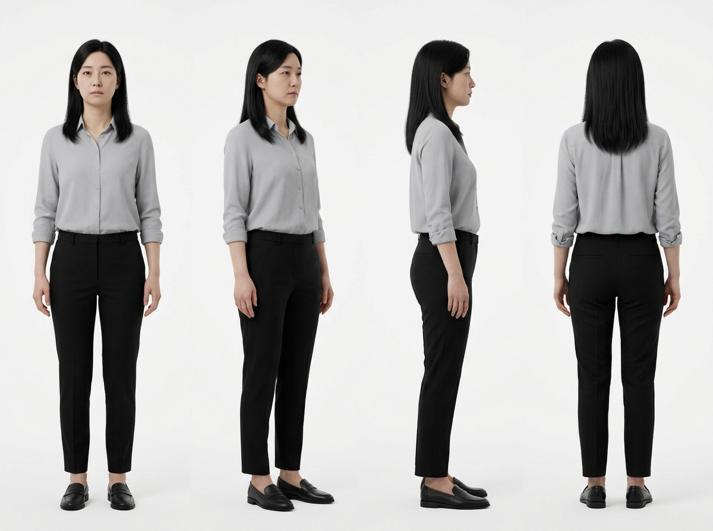
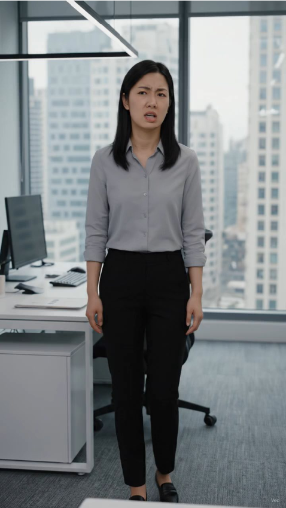
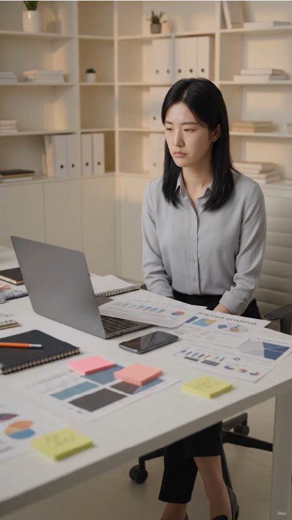
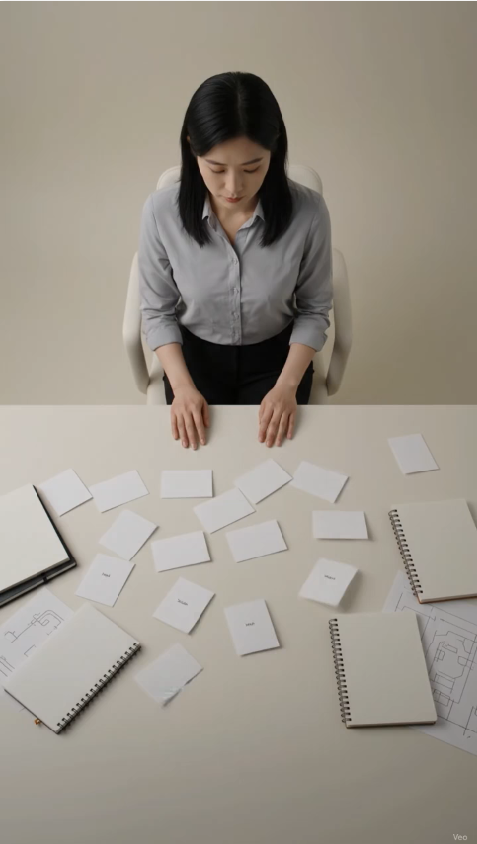
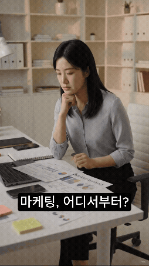

# Noted J 광고 스토리보드

## 1\. 프로젝트 개요 및 브랜드 아이덴티티

### 1-1. 프로젝트 기본 정보

| 항목 | 내용 |
| ----- | ----- |
| 브랜드명 | Noted J (노티드제이) |
| 광고 형식 | 숏폼 광고 영상 |
| 최종 영상 길이 | 9초 |
| 영상 비율 | 9:16 세로형 |
| 광고 목적 | 브랜드 인지도 확보 및 상담 문의 유도 |
| 핵심 서비스 | 소상공인 대상 블로그 및 SNS 콘텐츠 제작 컨설팅/대행 |
| 핵심 문제 | 마케팅 시작 단계에서의 모호함 및 실행력 부족 |
| 핵심 메시지 | 막막한 마케팅, Noted J가 정리하고 콘텐츠로 실행합니다. |
| 최종 유도 행동 | 인스타그램 DM을 통한 상담 문의 |

### 1-2. 브랜드 아이덴티티 정의

* **타겟 고객**: 자신의 브랜드를 성장시키고 싶으나, 홍보 인력 부족과 방법론의 부재로 인해 무엇부터 해야 할지 막막함을 느끼는 소상공인 및 1인 사업가  
* **톤앤매너**: Soft Ivory와 블루 포인트를 활용한 미니멀한 감성, 차분하고 전문적이며 신뢰감을 주는 비주얼 톤  
* **브랜드 슬로건**: Know. Note. Grow.  
* **차별점 (USP)**: 복잡하게 흩어진 브랜드 아이디어를 논리적으로 구조화(Note)하여, 실제 실행 가능한 SNS 콘텐츠 형태로 직접 도출 및 연결해주는 1인 비즈니스 최적화 마케팅 솔루션

### 1-3. 기획 의도 및 표현 전략

* **기획 의도**: 마케팅 프로세스 구축에 어려움을 겪는 소상공인의 보편적 감정을 직관적으로 자극하고, Noted J가 아이디어 정리부터 최종 실행까지 논스톱으로 해결해주는 파트너임을 인지시킨다.  
* **표현 전략**: '문제 제시 → 정리 → 실행 → 브랜드/CTA'로 이어지는 명확한 4단 서사 구조를 설계하여 9초의 한정된 시간 내에 핵심 메시지를 임팩트 있게 전달한다.

### 1-4. 전체 구성 요약 (타임라인)

| 구간 | 장면 목적 | 핵심 카피 (자막) |
| ----- | ----- | ----- |
| 0.0초 \~ 2.0초 | 소상공인의 막막한 현실 및 문제 제시 | 마케팅, 어디서부터? |
| 2.0초 \~ 4.5초 | 흩어진 아이디어의 정돈 과정 제시 | 브랜드에 맞게 정리하고 |
| 4.5초 \~ 7.5초 | 실제 SNS 콘텐츠로의 실행 단계 구축 | 콘텐츠로 바로 실행 |
| 7.5초 \~ 9.0초 | 브랜드 아이덴티티 각인 및 행동 유도 | Noted J / 상담 문의 |

---

## 2\. 멀티모달 생성 도구 및 파이프라인 계획

### 2-1. 메인 제작 파이프라인 개요

본 프로젝트는 기획 의도의 정교한 구현과 일관된 브랜드 경험 설계를 위해 각 멀티모달 영역별 생성 AI 도구의 특성을 반영한 파이프라인을 구축하였다.

* **이미지 생성**: Google Flow \- Nano Banana 2를 활용하여 키 비주얼 및 메인 캐릭터를 생성하고, 전체 씬의 비주얼 일관성을 유지하기 위한 참조 자산(Reference Asset)으로 고정한다.  
* **비디오 생성**: Google Flow \- Veo 3.1 Lite(Scene 1\~3) 및 Veo 3.1 Fast(Scene 4\) 모델을 연계하여, 동일 인물 기반의 짧은 모션과 시네마틱 전환 효과를 안정적으로 확보한다.  
* **오디오 생성**: Suno를 사용하여 보컬이 배제된 미니멀 앰비언트 사운드를 도출하여 브랜드 신뢰도를 증진한다.  
* **통합 편집**: CapCut을 사용하여 AI 소스의 음성을 정제하고, 자막 및 엔드카드 그래픽 요소를 마스터링한다.

### 2-2. 프롬프트 설계 및 번역 전략

* **지시어 구체화**: 미디엄샷, 탑뷰, 오버숄더 등 전문 카메라 구도 용어와 Soft Ivory, 라이팅 조건을 명시하여 AI 모델의 무작위성 생성을 통제한다.  
* **언어 모델 최적화**: 1차적으로 기획 의도를 정밀하게 반영한 한정적인 한글 프롬프트를 작성한 뒤, 생성 AI의 프롬프트 이해도와 텍스트 출력의 일관성을 극대화하기 위해 이를 정교한 영문 지시어로 번역·최적화하여 입력 소스로 활용하였다.

### 2-3. 리소스 제약에 따른 대체 파이프라인 최적화 전략

* **문제 상황 (리소스 제약)**  
  * 전반부(Scene 1\~3) 자원 집중 투자로 인한 최종 씬 가용 크레딧 전량 소진  
  * Scene 4 제작 시 기존 메인 캐릭터 이미지 참조(Character Reference) 파이프라인 유지 불가능

* **대응 전략 (대체 도구 운영)**  
  * 이미지 참조 없이 독자적 프롬프트 제어가 가능한 **Google Flow \- Veo 3.1 Lite** 모델 긴급 가동  
  * 한정된 자원 속에서 광고 패키지의 서사적 종결성 및 9초 타임라인 방어를 위한 전략적 스위칭  
* **비주얼 변동 원인 및 조치**  
  * 캐릭터 참조 자산 미사용으로 인해 주인공 의상이 일부 변경(회색 블라우스 → 민소매)  
  * 대체 모델의 프롬프트 제어를 통해 Noted J 브랜드 고유의 'Soft Ivory' 배경 톤 및 오버숄더 구도 일관성 고수  
* **최종 기대 효과**  
  * 생성형 AI 공정의 리소스 한계를 능동적으로 관리하여 기한 내 완결성 확보  
  * 가용한 도구 특성 극대화로 브랜드 핵심 메시지 및 톤앤매너를 최종 마스터링 단계까지 안정적으로 유지

---

## 3\. 씬별 광고 스토리보드 (기획 및 생성 결과)

### 3-1. 기준 이미지 생성 (캐릭터 일관성 확보 단계)

* **생성 목적**: 영상 전체의 몰입도를 저해하는 인물/화풍 불일치 문제를 방지하기 위해, 기준이 되는 메인 캐릭터 레퍼런스를 선제적으로 도출한다.  
* **사용 도구**: Google Flow \- Nano Banana 2  
* **출력 결과**: 차분하고 신뢰감 있는 30대 여성 소상공인 키 비주얼 확보  
* **파일명**: [MainCharacter_KeyVisual_NanoBanana2.jpeg](../images/B1-2/MainCharacter_KeyVisual_NanoBanana2.jpeg)
* **프롬프트 원문**:  
  * 핵심 피사체: 30대 초반의 한국인 여성, 어깨까지 오는 검은 생머리, 1인 사업가로 마케팅이 막막한 분위기  
  * 고정 의상: 연한 회색 블라우스와 검은색 슬랙스 바지  
  * 고유 특징: 무표정  
  * 레이아웃 (필수): \[Split screen, Character concept sheet, Multiple views from different angles: front view, 45-degree side view, profile side view, back view\] 한 장의 이미지에 전신(Full body)의 다양한 각도가 모두 포함되도록 구성할 것.   
  * 배경 및 조명: \[Plain white background, High-key lighting\] 배경은 아무것도 없는 흰색으로 설정하고, 인물에 그림자가 지지 않도록 균일한 조명을 사용할 것. 흰 배경에 인물만 생성하고 그 외 글자나 중간선 등은 생성하지 말것.  
  * 화질 및 스타일: 8k resolution, Photorealistic, Cinematic realism, Unreal engine 5 render

| 생성 결과 |
| ----- |
| **** |

---

### 3-2. Scene 1 (도입 / 문제 제시)

* **씬 번호 / 길이**: Scene 1 / 2.0초  
* **목표 메시지**: 마케팅을 어디서부터 시작해야 할지 몰라 고뇌하는 소상공인의 현실을 보여준다.  
* **화면 구성**: 미디엄샷 구도. 30대 여성 주인공이 책상 위 노트북과 마케팅 자료를 바라보며 깊은 고민에 잠긴 모습. 생성 비디오 내 텍스트 없음.  
* **화면 카피 (자막)**: 마케팅, 어디서부터?  
* **사용 도구 및 목적**: 기준 캐릭터 이미지 고정 적용 \+ Veo 3.1 Lite (인물의 미세 동작 및 심리 표현 유도)  
* **오디오 구성**: 음성(내레이션)은 브랜드의 절제된 톤앤매너 유지를 위해 배제하고, 배경음악의 인트로 파트 배치.  
* **생성 결과 요약 및 파일명**: 1인 사업가의 막막한 감정과 정돈된 작업 공간의 분위기가 구체적으로 매칭되어 고품질 비주얼 확보 ([Scene01_Final_Veo3.1Lite.mp4](../videos/B1-2/Scene01_Final_Veo3.1Lite.mp4))  
* **프롬프트 개발 및 개선 로그**:  
  * **초안결과물**: [Scene01_Draft_Veo3.1Lite.mp4](../videos/B1-2/Scene01_Draft_Veo3.1Lite.mp4) (참고용, 인물 구도 미제어 확인)  
  * **초안 프롬프트**: (한글) 첨부된 이미지 속 인물이 주인공이며, 주인공은 마케팅을 시작하고 싶지만 어디서부터 시작해야 할지 몰라 막막한 상황에 처해 있습니다. / (영문) The character in the attached image is the protagonist, and the protagonist wants to start marketing but is in a situation where they are at a loss as to where to begin.  
  * **초안 문제점**: 인물의 구체적인 행동 조건, 카메라 워킹, 가구 및 소품의 배치가 모호하여 AI가 화면 구도를 제어하지 못함.  
  * **최종 반영 프롬프트 (원문)**:  
    * **한글**: 첨부한 이미지의 인물을 영상 속 주인공으로 유지한다. 주인공은 30대 한국 여성 1인 사업가이며, 자신의 브랜드를 성장시키기 위해 마케팅을 시작하고 싶지만 어디서부터 시작해야 할지 몰라 막막한 상황에 놓여 있다. 작은 정돈된 작업 공간의 책상 앞에 앉아 노트북 화면과 마케팅 자료를 바라보며 깊게 고민하는 모습. 책상 위에는 노트, 스마트폰, 메모지, 브랜드 관련 자료가 자연스럽게 놓여 있다. 주인공은 여러 자료를 천천히 확인하고, 잠시 생각에 잠긴 뒤 작은 한숨을 내쉰다. 한숨 소리만 아주 희미하게 들리도록 생성하고, 배경 음악이나 불필요한 효과음은 생성하지 않는다. 한숨 표현을 위해 연기, 과장된 움직임, 감정적인 연출은 추가하지 않는다. 첨부 이미지의 얼굴, 헤어스타일, 의상, 인물 특징을 유지하며 자연스러운 눈 움직임과 손동작, 현실적인 표정 변화를 표현한다. 고민과 막막함이 느껴지지만 포기하지 않고 방향을 찾으려는 1인 사업가의 감정을 담는다. 카메라는 인물을 중심으로 자연스럽게 천천히 이동하는 부드러운 시네마틱 돌리 무브. 주인공은 항상 화면 중앙에 안정적으로 보이며, 책상 위 자료와 고민하는 표정이 함께 보이는 미디엄샷 구도. 따뜻한 자연광, Soft Ivory 톤의 정돈된 작업 공간, 현실적인 브랜드 스토리텔링 영상 스타일. 과장된 연출 없이 실제 창업자의 일상을 담은 듯한 시네마틱 분위기. 구도: 책상 앞 인물 중심 미디엄샷 피사체: 고민하는 소상공인, 노트, 휴대폰, 마케팅 자료 배경: Soft Ivory 톤의 깔끔하고 정돈된 작업 공간 스타일: 시네마틱 리얼리즘, 자연스러운 움직임 텍스트 없음 화면 비율: 9:16 세로 영상 영상 길이: 3초  
    * **영문**: Keep the person from the attached image as the main character in the video. The main character is a Korean woman in her 30s who runs a solo business. She wants to grow her brand through marketing but feels overwhelmed because she does not know where to start. She is sitting at a desk in a small, organized workspace, looking at her laptop screen and marketing materials with a thoughtful and uncertain expression. On the desk are a notebook, smartphone, sticky notes, and various brand-related documents placed naturally. The character slowly reviews the materials, pauses in deep thought, and lets out a very subtle sigh. Generate only a faint sigh sound and do not create any background music or unnecessary sound effects. Do not add smoke, exaggerated acting, or artificial visual effects to represent the sigh. Maintain the same facial features, hairstyle, clothing, and identity of the person in the attached image. Show natural eye movement, realistic hand gestures, and authentic emotional expression. The mood should convey a solo business owner feeling lost and uncertain while trying to find the right direction. The camera performs a slow, smooth cinematic dolly movement around the character while keeping her centered in the frame. Use a medium shot composition showing both her thoughtful expression and the marketing materials on the desk. Warm natural lighting, Soft Ivory toned clean workspace, realistic cinematic brand storytelling style. The scene should feel like a real moment from an entrepreneur’s daily life, without exaggerated drama. Composition: Medium shot, person centered in front of the desk Subject: Thoughtful small business owner, notebook, smartphone, marketing materials Background: Clean and organized workspace with Soft Ivory tones Style: Cinematic realism, natural movement No text Aspect ratio: 9:16 vertical video Duration: 3 seconds  
  * **결과 변화**: 구도 제어력이 향상되어 책상 위 소품과 인물의 시네마틱 돌리 무브가 안정적으로 매칭됨

| 초안 영상 캡처 | 최종 영상 캡처 |
| :---: | :---: |
|  |  |

    

---

### 3-3. Scene 2 (전환 / 해결 방향 제시)

* **씬 번호 / 길이**: Scene 2 / 2.5초  
* **목표 메시지**: Noted J가 복잡한 비즈니스 마인드맵을 논리적 구조로 정리함을 시각화한다.  
* **화면 구성**: 책상 위를 내려다보는 탑뷰 구도. 무질서하게 흐트러져 있던 메모지와 카드 세트가 정해진 축을 따라 부드럽게 이동하며 미니멀한 레이아웃으로 자동 정렬되는 모션. 텍스트 배제.  
* **화면 카피 (자막)**: 브랜드에 맞게 정리하고  
* **사용 도구 및 목적**: Veo 3.1 Lite (오브젝트의 자연스러운 물리 이동 및 정렬 애니메이션 구현)  
* **오디오 구성**: 음성 제외(No voice 조건 명시), 고요하고 집중도 높은 브랜드 앰비언트 사운드 지속.  
* **생성 결과 요약 및 파일명**: 아이디어가 하나의 체계적인 구조로 결합되는 모션 전환 컷 안정적 획득 ([Scene02_Final_Veo3.1Lite.mp4](../videos/B1-2/Scene02_Final_Veo3.1Lite.mp4))  
* **프롬프트 원문**:  
  * **한글**: 첨부한 이미지의 인물을 영상 속 주인공으로 유지한다. 주인공은 30대 한국 여성 1인 사업가이며, 자신의 브랜드를 성장시키기 위해 마케팅을 고민하고 있지만 머릿속에 흩어진 아이디어와 정보를 어떻게 정리해야 할지 막막한 상황이다. 주인공이 책상 위에 흩어져 있는 메모, 카드, 자료들을 바라보는 장면에서 시작한다. 여러 개의 메모 카드와 종이 자료가 자연스럽게 놓여 있고, 복잡하게 흩어진 아이디어들이 천천히 정돈되는 과정을 시각적으로 표현한다. 메모 카드와 요소들이 부드럽게 이동하며 하나의 방향성 있는 레이아웃으로 정렬되고, 흩어진 생각이 브랜드 방향으로 정리되는 느낌을 보여준다. 인물은 아무 말도 하지 않는다. 입 모양 변화, 대화하는 움직임, 음성 생성은 절대 만들지 않는다. 배경음악과 모든 불필요한 효과음은 생성하지 않는다. 조용하고 집중된 분위기만 표현한다. 카메라는 상단 시점 또는 정면 중심의 안정적인 그래픽 구성으로 촬영한다. 책상 위 오브젝트와 정리되는 흐름이 명확하게 보이도록 구성하고, 미니멀한 브랜드 영상 스타일로 표현한다. 흩어진 메모와 카드, 라인 요소들이 자연스럽게 연결되고 정렬되면서 복잡한 아이디어가 하나의 명확한 브랜드 구조로 정리되는 모습을 보여준다. Noted J가 소상공인의 복잡한 생각을 이해하고 브랜드에 맞는 방향으로 정리해주는 브랜드임을 시각적으로 전달한다. Soft Ivory 톤의 깔끔한 배경, 따뜻한 자연광, 미니멀하고 세련된 시네마틱 디자인. 과장된 애니메이션 효과 없이 실제 브랜드 컨설팅 과정처럼 자연스럽게 표현한다. 구도: 상단 시점 또는 정면 중심의 그래픽 구성 피사체: 흩어진 메모, 카드, 라인 요소, 정렬되는 레이아웃, 정리되는 아이디어 배경: Soft Ivory 톤의 정돈된 공간 스타일: 미니멀 브랜드 필름, 시네마틱 리얼리즘 텍스트 없음 음성 없음 배경음 없음 화면 비율: 9:16 세로 영상  
  * **영문**: Keep the person from the attached image as the main character in the video. The main character is a Korean woman in her 30s who runs a solo business. She wants to grow her brand through marketing but feels overwhelmed because her ideas and information are scattered and she does not know how to organize them into a clear direction. The scene begins with scattered notes, cards, and brand materials placed on a desk. The character observes the messy collection of ideas. The scattered notes, cards, and visual elements slowly move and organize themselves into a clean, structured layout. Show the transformation from scattered thoughts into a clear brand direction through smooth and minimal visual movement. The character does not speak at any moment. Do not generate lip movement, talking expressions, voice, or dialogue. Do not create background music or unnecessary sound effects. Keep the atmosphere quiet, focused, and calm. Use a top-down view or a front-facing centered composition with a clean graphic layout. Clearly show the desk objects and the organizing process. Create a minimal brand film style with elegant and thoughtful visual storytelling. The movement of notes, cards, and lines should feel natural as they connect and align into a meaningful structure. The scene should visually communicate that Noted J helps small business owners organize complex ideas and transform them into a clear brand direction. Soft Ivory background, warm natural lighting, minimal and sophisticated cinematic design. Avoid exaggerated animation effects. Make it feel like a real brand consulting process captured in a premium brand video. Composition: Top-down view or centered front-facing graphic composition Subject: Scattered notes, cards, line elements, organized layout, structured ideas Background: Soft Ivory toned clean workspace Style: Minimal brand film, cinematic realism No text No voice No background music Aspect ratio: 9:16 vertical video

---

### 3-4. Scene 3 (심화 / 서비스 실행 제시)

* **씬 번호 / 길이**: Scene 3 / 3.0초  
* **목표 메시지**: 정리된 기획이 실제 블로그 및 SNS 전략 콘텐츠 실행 체계로 구체화됨을 연출한다.  
* **화면 구성**: 정면 그래픽 중심 구도. 정렬된 카드 요소들 사이에 미니멀한 연결선(Line)과 카테고리화 인디케이터가 생성되며 가상의 실행 맵을 빌드업하는 과정. 가독 텍스트 배제.  
* **화면 카피 (자막)**: 콘텐츠로 바로 실행  
* **사용 도구 및 목적**: Veo 3.1 Lite (인포그래픽적 요소의 고해상도 물리 렌더링 유지)  
* **오디오 구성**: 음성 배제, 사운드의 긴장감 유지 및 빌드업 파트 돌입.  
* **생성 결과 요약 및 파일명**: 기획에서 실행 단계로의 연결성을 시각적 그래픽 흐름으로 표현 완성 ([Scene03_Final_Veo3.1Lite.mp4](../videos/B1-2/Scene03_Final_Veo3.1Lite.mp4))  
* **프롬프트 원문**:  
  * **한글**: 첨부한 이미지의 인물을 영상 속 주인공으로 유지한다. 주인공은 30대 한국 여성 1인 사업가이며, 자신의 브랜드를 성장시키기 위해 다양한 아이디어와 콘텐츠를 실행하려는 상황이다. 이전 단계에서 흩어져 있던 생각들이 브랜드 전략에 맞는 방향으로 정리되고, 실제 실행 가능한 콘텐츠 구조로 변화하는 과정을 시각적으로 표현한다. 화면은 책상 위를 중심으로 한 상단 시점 또는 정면 중심의 그래픽 구성으로 보여준다. 처음에는 여러 개의 흩어진 메모 카드, 노트, 아이디어 조각, 선(Line) 요소들이 불규칙하게 배치되어 있다. 이후 각각의 요소들이 천천히 이동하며 카테고리별로 정렬되고, 연결선이 생기면서 하나의 체계적인 콘텐츠 전략 레이아웃으로 완성된다. 흩어진 아이디어가 단순히 정리되는 것이 아니라 브랜드의 핵심 방향, 콘텐츠 흐름, 실행 단계로 구조화되는 느낌을 표현한다. 복잡한 생각이 명확한 전략으로 바뀌는 과정을 미니멀한 그래픽 움직임으로 보여준다. 화면 안에는 읽을 수 있는 텍스트나 키워드 요소를 생성하지 않는다. 브랜드 전략 구조는 메모, 카드, 연결선, 정렬된 레이아웃 같은 시각적 구성만으로 표현한다. 왜곡되거나 의미 없는 글자도 생성하지 않는다. 주인공은 말을 하지 않는다. 입 모양 변화, 대화하는 행동, 음성 생성은 절대 만들지 않는다. 배경음악과 불필요한 효과음은 생성하지 않는다. 조용하고 집중된 브랜드 작업 분위기를 유지한다. 카메라는 안정적인 상단 시점 또는 정면 중심 구도를 유지하며, 정렬되는 레이아웃과 변화 과정이 명확하게 보이도록 부드럽게 이동한다. Soft Ivory 톤의 배경, 따뜻한 자연광, Noted J의 미니멀하고 정돈된 브랜드 아이덴티티를 반영한다. 복잡한 아이디어가 브랜드 방향으로 정리되고 실행 가능한 콘텐츠로 연결되는 과정을 보여주는 프리미엄 브랜드 영상 스타일. 구도: 상단 시점 또는 정면 중심의 그래픽 구성 피사체: 흩어진 메모, 카드, 라인 요소, 정렬되는 레이아웃, 콘텐츠 전략 구조 배경: Soft Ivory 톤의 정돈된 공간 텍스트: 없음 음성 없음 배경음 없음 스타일: 미니멀 브랜드 필름, 시네마틱 그래픽 리얼리즘 목표: Noted J가 복잡한 아이디어를 브랜드에 맞는 방향으로 정리하고 실행 가능한 콘텐츠 전략으로 연결하는 브랜드임을 보여준다. 화면 비율: 9:16 세로 영상  
  * **영문**: Keep the person from the attached image as the main character in the video. The main character is a Korean woman in her 30s who runs a solo business. She is preparing to execute marketing ideas to grow her brand. Show the process of transforming scattered thoughts and ideas into an organized content strategy aligned with the brand direction. Use a top-down view or centered front-facing graphic composition focused on the desk. At the beginning, multiple scattered note cards, notebooks, idea fragments, and line elements are randomly placed. Slowly, these elements move and organize themselves into structured categories. Connecting lines appear naturally, forming a clear content strategy layout and an actionable brand framework. Show that the ideas are not simply organized, but transformed into a meaningful structure with brand direction, content flow, and execution steps. Visualize the transition from complex thoughts into a clear strategy through minimal and elegant graphic motion. Do not include readable text or keyword elements on the screen. Represent the brand strategy structure only through visual composition such as notes, cards, connecting lines, and organized layout. Do not generate distorted or meaningless text. The character does not speak. Do not generate lip movement, talking expressions, voice, or dialogue. Do not create background music or unnecessary sound effects. Maintain a quiet and focused brand workspace atmosphere. Keep the camera stable with a top-down or centered front-facing composition. Use smooth camera movement to clearly show the organizing process and transformation of the layout. Soft Ivory background, warm natural lighting, minimal and refined Noted J brand identity. Premium brand film style showing how complex ideas become organized brand strategies and actionable content plans. Composition: Top-down view or centered front-facing graphic composition Subject: Scattered notes, cards, line elements, organized layout, content strategy structure Background: Soft Ivory toned clean workspace No text No voice No background music Style: Minimal brand film, cinematic graphic realism Goal: Show that Noted J organizes complex ideas into a brand-aligned direction and connects them into actionable content strategies. Aspect ratio: 9:16 vertical video

---

### 3-5. Scene 4 (종료 / 브랜드 인지 및 엔드카드)

※ 본 씬은 2-3에 기술된 바와 같이 크레딧 소진으로 인해 레퍼런스 자산 연동 없이 독자 프롬프트(맨팔 연출 지시)로 빌드되어 의상 변동이 반영된 씬임

* **씬 번호 / 길이**: Scene 4 / 1.5초 (통합 편집본 최종 스케일 기준)  
* **목표 메시지**: 완성된 성과를 확인하는 만족감 부여 및 최종 행동(상담 문의) 촉구.  
* **화면 구성**: 오버숄더(Over-the-shoulder) 구도. 주인공이 스마트폰을 들고 잘 정돈된 인스타그램 격자 피드 레이아웃을 위아래로 자연스럽게 스크롤하며 검토하는 모습. 이후 미니멀한 브랜드 엔드카드로 정밀 페이드아웃 전환.  
* **화면 카피 (자막)**: Noted J / Know. Note. Grow. / 브랜드 성장을 위한 마케팅 상담 문의(DM)  
* **사용 도구 및 목적**: Veo 3.1 Fast (오버숄더 구도의 고속 렌더링 및 모션 트래킹 안정화)  
* **오디오 구성**: 사운드가 피크에 도달한 후 차분하게 마무리되는 클라이맥스 구간.  
* **생성 결과 요약 및 파일명**: 피드 확인 모션과 편집 단에서 고해상도로 얹어진 텍스트 엔드카드가 결합하여 마케팅 완결성 구축, 최종 컷에서는 스마트폰 스크롤 구간이 짧게 처리되고 엔드카드로 빠르게 연결됨 ([Scene04_Final_Veo3.1Fast.mp4](../videos/B1-2/Scene04_Final_Veo3.1Fast.mp4))  
* **프롬프트 원문**:  
  * **한글**: 주인공은 30대 한국 여성 1인 사업가이다. 이전 영상과 자연스럽게 이어지도록 동일한 인물과 분위기를 유지한다. 스마트폰을 들고 있는 팔과 스크롤하는 팔은 옷 소매가 없는 자연스러운 맨팔이어야 한다. 주인공은 브랜드 성장을 위해 정리된 아이디어를 실제 인스타그램 콘텐츠로 실행하고, 완성된 결과물을 확인하는 순간이다. 카메라는 주인공 뒤쪽에 위치한 오버숄더 시점(Over-the-shoulder shot)으로 촬영한다. 시청자는 주인공의 시선과 같은 위치에서 스마트폰 화면을 바라보며, 직접 스마트폰을 사용하는 것 같은 몰입감을 느낀다. 주인공은 왼손으로 스마트폰을 들고 오른손 검지로 화면을 천천히 위아래로 스크롤한다. 스마트폰 화면에는 브랜드 스타일에 맞게 제작된 인스타그램 피드, 게시물 카드, 콘텐츠 이미지, 썸네일 레이아웃이 자연스럽게 보인다. 얼굴 전체는 강조하지 않고, 어깨 너머로 보이는 자연스러운 자세, 맨팔의 움직임, 손동작, 스마트폰 화면, 콘텐츠 확인 과정에 집중한다. 스마트폰 화면 속 텍스트는 생성하지 않는다. 실제 문장이나 읽을 수 있는 글자는 만들지 않고 이미지, 레이아웃, 브랜드 디자인 요소만 표현한다. 주인공은 말을 하지 않는다. 입 모양 변화, 대화 행동, 음성 생성은 절대 만들지 않는다. 배경음악과 효과음은 생성하지 않는다. 카메라는 주인공 뒤쪽에서 스마트폰 화면과 손동작을 안정적으로 따라가며 부드럽게 이동한다. 자연스럽고 흔들림 없는 시네마틱 카메라 움직임을 유지한다. 이후 화면은 자연스럽게 전환되어 Noted J 브랜드 엔드카드로 연결된다. 엔드카드는 중앙 정렬된 미니멀한 브랜드 화면이다. 별도 로고 이미지는 사용하지 않는다. Soft Ivory 배경과 블루 포인트 컬러를 활용한다. 중앙에는 브랜드명 Noted J를 배치하고, 아래에는 슬로건과 상담 문의 CTA를 정렬한다. 엔드카드 텍스트: Noted J Know. Note. Grow. 브랜드 성장을 위한 마케팅 상담 문의(DM) Pretendard 서체 사용. 사용이 불가능하면 유사한 고딕 계열 폰트 사용. 폰트 컬러: Insight Blue (\#405BD8), Bright Growth Sky Blue (\#5ED6FF), Ink Black (\#222222). 깔끔한 전환과 정돈된 레이아웃으로 마무리하며, Noted J가 복잡한 아이디어를 정리하고 브랜드에 맞는 SNS 콘텐츠 실행까지 연결하는 브랜드임을 전달한다. 구도: 전반부 \- 주인공 뒤쪽 오버숄더 시점, 스마트폰 화면 중심 후반부 \- 중앙 정렬 엔드카드 구성 피사체: 30대 한국 여성 1인 사업가, 맨팔, 스마트폰, 인스타그램 피드, SNS 콘텐츠 카드, 브랜드명, 슬로건, 상담 CTA 배경: 전반부 \- Soft Ivory 톤의 정돈된 작업 공간 후반부 \- Soft Ivory \+ 블루 포인트 브랜드 배경 텍스트: 인스타그램 화면 없음 엔드카드 있음 음성 없음 배경음 없음 스타일: 미니멀 브랜드 필름, 시네마틱 광고 스타일 화면 비율: 9:16 세로 영상  
  * **영문**: Korean woman in her 30s running a solo business. Maintain the same character identity and visual continuity from the previous scene. The arm holding the smartphone and the arm scrolling the screen must have natural bare skin with no visible clothing sleeves. This scene shows the moment when she transforms organized ideas into actual Instagram content for brand growth and checks the completed result. Use an over-the-shoulder shot from behind the character. The camera is positioned behind her shoulder, allowing the viewer to see the smartphone from her perspective. The viewer should feel as if they are personally looking at the phone and scrolling through the Instagram feed. She holds the smartphone with her left hand and slowly scrolls up and down with her right index finger. The smartphone screen shows a branded Instagram feed with organized post cards, content images, and thumbnail layouts matching the brand identity. Do not focus on the full face. Focus on the natural posture from behind, bare arm movement, hand gestures, smartphone interaction, and the process of reviewing completed content. Do not generate readable text on the smartphone screen. Do not create real sentences or recognizable words. Use only images, layouts, and brand design elements. The character does not speak. Do not generate lip movement, dialogue, or voice. Do not create background music or sound effects. The camera smoothly follows from behind while tracking the smartphone screen and hand movement. Keep the motion stable, natural, and cinematic. Transition smoothly into the Noted J brand end card. The end card is a centered minimal brand screen. Do not use a separate logo image. Use a Soft Ivory background with blue accent colors. Place “Noted J” in the center, with the slogan and CTA below. End card text: Noted J Know. Note. Grow. Marketing consultation for brand growth (DM) Use Pretendard font if available, otherwise use a similar clean Gothic font. Font colors: Insight Blue (\#405BD8) Bright Growth Sky Blue (\#5ED6FF) Ink Black (\#222222) Finish with a clean transition and organized layout. Show that Noted J organizes complex ideas and connects them to brand-aligned Instagram content execution. Composition: First half: Over-the-shoulder shot from behind, smartphone-focused view Second half: Center-aligned end card Subject: Korean woman in her 30s, bare arms, smartphone, Instagram feed, social media content cards, brand name, slogan, CTA Background: First half: Soft Ivory organized workspace Second half: Soft Ivory background with blue accents Text: Instagram screen: None End card: Yes No voice No background music Style: Minimal brand film, cinematic advertising style Aspect ratio: 9:16 vertical video  
* **의상 프롬프트 반영 씬 캡처**

| 회색 블라우스 | 민소매 |
| ----- | ----- |
|  |  |

---

## 4\. 대체 생성 도구를 통한 파이프라인 다각화 및 검증 (보너스 미션)

※ 본 항목은 브랜드 광고 본편의 기획 기조와 별개로, 멀티모달 엔진의 기술적 한계를 테스트하기 위한 보너스 검증 트랙임

### 4-1. OpenAI Sora 2 활용 영상 재제작 개요

본 섹션은 동일한 기본 기획 스토리보드를 엄격하게 유지한 채, 비디오 엔진만 **OpenAI Sora 2**로 스위칭하여 동일한 Scene 1 컷을 재구현한 교차 검증 트랙이다. 주 목적은 엔진 변화에 따른 한국어 발화 데이터 처리 능력, 입모양 싱크(Lip-sync)의 해상도 및 감정 표현의 극적 일관성을 정량적으로 비교 평가하는 데 있다.

### 4-2. 재제작 조정 사양 및 표현 통제

* **스토리보드 구조**: 세로형 9:16 스케일, 주인공 아이덴티티 및 Soft Ivory 톤 작업실 레이아웃 완전 유지.  
* **파라미터 변동 요인**: 비디오 자체에 한국어 음성 트랙이 정밀 동기화되도록 지시어 레이어 수정. 인물이 혼잣말로 차분하게 "마케팅, 어디서부터?"를 직접 발화하도록 제어 프로토콜 설계.  
* **생성 결과물 명칭**: [NotedJ_Final_Master_Video.mp4](../videos/B1-2/NotedJ_Final_Master_Video.mp4)

### 4-3. 도구 성능 평가 및 분석 결과

* **입모양 싱크 및 오디오 매칭**: Sora 2 엔진은 한국어 음소 데이터에 부합하는 자연스러운 구강 구조 움직임을 매칭하여 음성과 시각 정보의 미스매치 현상을 근본적으로 해결함.  
* **감정선 제어 능력**: 과장되지 않은 잔잔한 톤의 고민 표현을 미세 표정 변화로 도출하여 브랜드가 추구하는 미니멀 시네마틱 리얼리즘 스타일에 완벽하게 부합함.  
* **결론**: 본 검증을 통해 차분한 감정 표현과 직접 발화 기반의 숏폼 광고 파이프라인 설계 시 OpenAI Sora 2가 최적의 대안 자산이 될 수 있음을 증명함.

### 4-4. 재제작 전용 프롬프트 데이터

* **한글**: 첨부한 이미지의 인물을 영상 속 주인공으로 유지한다. 주인공은 30대 한국 여성 1인 사업가이며, 자신의 브랜드를 성장시키기 위해 마케팅을 시작하고 싶지만 어디서부터 시작해야 할지 몰라 막막한 상황에 놓여 있다. 작은 정돈된 작업 공간의 책상 앞에 앉아 노트북 화면과 마케팅 자료를 바라보며 깊게 고민하는 모습. 책상 위에는 노트, 스마트폰, 메모지, 브랜드 관련 자료가 자연스럽게 놓여 있다. 주인공은 여러 자료를 천천히 확인하고 잠시 생각에 잠긴 뒤, 자연스럽게 한국어로 "마케팅, 어디서부터?"라고 말한다. 음성은 차분한 30대 한국 여성의 자연스러운 목소리로 생성하며, 실제 한국 사람이 말하는 것처럼 정확한 한국어 발음과 입모양 싱크를 맞춘다. 말할 때 과장된 표정 변화나 연기는 추가하지 않고, 고민 중 혼잣말처럼 작게 말하는 자연스러운 분위기로 표현한다. 첨부 이미지의 얼굴, 헤어스타일, 의상, 인물 특징을 그대로 유지하며 자연스러운 눈 움직임과 손동작, 현실적인 표정 변화를 표현한다. 고민과 막막함이 느껴지지만 포기하지 않고 방향을 찾으려는 1인 사업가의 감정을 담는다. 대사는 "마케팅, 어디서부터?" 한 문장만 생성하며, 배경 음악이나 불필요한 효과음은 생성하지 않는다. 초기 고민 장면의 분위기를 유지하기 위해 음성은 작고 자연스럽게 표현한다. 카메라는 인물을 중심으로 자연스럽게 천천히 이동하는 부드럽게 시네마틱 돌리 무브. 주인공은 항상 화면 중앙에 안정적으로 보이며, 책상 위 자료와 고민하는 표정이 함께 보이는 미디엄샷 구도. 따뜻한 자연광, Soft Ivory 톤의 정돈된 작업 공간, 현실적인 브랜드 스토리텔링 영상 스타일. 과장된 연출 없이 실제 창업자의 일상을 담은 듯한 시네마틱 분위기. 구도: 책상 앞 인물 중심 미디엄샷 피사체: 고민하는 소상공인, 노트, 휴대폰, 마케팅 자료 배경: Soft Ivory 톤의 깔끔하고 정돈된 작업 공간 스타일: 시네마틱 리얼리즘, 자연스러운 움직임 텍스트 없음 화면 비율: 9:16 세로 영상 영상 길이: 3초  
* **영문**: Keep the person from the attached image as the main character of the video. The main character is a Korean woman in her 30s who runs a one-person business. She wants to start marketing to grow her own brand but feels overwhelmed because she does not know where to begin. She is sitting at a desk in a small, clean, and organized workspace, looking at her laptop screen and marketing materials with deep thought. On the desk, naturally placed items include a notebook, smartphone, sticky notes, and brand-related documents. The character slowly reviews the materials, pauses for a moment in thought, and naturally says in Korean: "마케팅, 어디서부터?" Generate the voice as a calm and natural Korean female voice in her 30s. Match accurate Korean pronunciation and precise lip synchronization as if spoken by a real Korean person. Avoid exaggerated facial expressions or acting. The delivery should feel like a quiet self-talk moment while she is thinking. Maintain the exact facial features, hairstyle, clothing, and characteristics of the person in the attached image. Show natural eye movement, subtle hand gestures, and realistic changes in facial expression. Express the emotion of a solo entrepreneur who feels uncertain and overwhelmed but is still trying to find the right direction. Generate only the single spoken sentence: "마케팅, 어디서부터?" Do not create background music or unnecessary sound effects. Keep the voice quiet and natural to maintain the atmosphere of the initial 고민 scene. The camera performs a smooth cinematic dolly movement, slowly moving around the character. Keep the main character stable in the center of the frame. Use a medium shot composition showing both the character's thoughtful expression and the marketing materials on the desk. Warm natural lighting, a clean and organized Soft Ivory-toned workspace, realistic brand storytelling video style. Create a cinematic atmosphere that feels like a real daily moment of an entrepreneur without exaggerated direction. Composition: Medium shot focused on the person sitting at the desk Subject: Thoughtful small business owner, notebook, smartphone, marketing materials Background: Clean and organized Soft Ivory-toned workspace Style: Cinematic realism, natural movement No text Aspect ratio: Vertical 9:16 video Duration: 3 seconds

---

## 5\. 오디오 생성 및 음향 설계

### 5-1. 오디오 소스 설계 사양

* **사용 도구**: Suno  
* **생성 목적**: 미니멀리즘 비주얼 톤을 강화하고 소상공인의 고민에서 인지 단계로 넘어가는 흐름을 청각적으로 제어하는 배경음악 레이어 구축.  
* **사운드 특성**: 보컬 및 대사 간섭을 배제한 연주곡 형태, 마지막 CTA 도달 시 상승하는 마감 템포 적용.  
* **파일명**: [NotedJ_BGM_Suno_AI_MusicGeneration.mp3](../audio/B1-2/NotedJ_BGM_Suno_AI_MusicGeneration.mp3) 
* **입력 프롬프트 (영문 원문)**:  
    
  Minimal corporate ambient music, soft piano and light airy synth, clean and modern, calm but hopeful, 10 seconds, suitable for a premium marketing brand ad, no vocals, subtle rise toward the end.

---

## 6\. 최종 통합 편집 및 마스터링 계획

### 6-1. 편집 프로토콜 및 인코딩 사양

* **사용 소프트웨어**: CapCut  
* **핵심 편집 제어**:  
  * AI 비디오 소스가 생성 단계에서 무작위로 출력한 불필요한 미세 잡음 및 이상 음성 트랙을 100% 거르고 완전 소거 처리  
  * Suno 마스터 오디오 소스를 전체 타임라인에 맞게 레벨링 및 페이드 인/아웃 병합  
  * 자막 카피 레이어 가독성 편집 및 마감 엔드카드 구간 그래픽 텍스트 정밀 고정  
* **타임라인 조율**: 각 생성 자산의 개별 길이를 분석한 뒤, 숏폼의 빠른 화면 전환 호흡을 극대화하기 위해 유기적으로 컷 편집하여 최종 비디오 규격을 **9초** 정밀 타임라인으로 확정함

### 6-2. 최종 마스터 출력 비디오 스펙

* **형식 및 코덱**: MP4 (Video: H.264 / Audio: AAC)  
* **해상도 및 프레임 레이트**: 1080p 고해상도 세로형 (1080x1920) / 30fps 안정 프레임 고정  
* **최종 제출 마스터 파일명**: [NotedJ_Final_Master_Video.mp4](../videos/B1-2/NotedJ_Final_Master_Video.mp4)

### 6-3. 최종 결과 미리보기
최종 통합 편집 완료 후 결과 확인을 위한 미리보기 GIF입니다.

고화질 최종 마스터 영상:
🎥 [NotedJ_Final_Master_Video.mp4](../videos/B1-2/NotedJ_Final_Master_Video.mp4)

### 6-4. 최종 산출물 자산 보존 리스트

1. 주인공 기준 키 비주얼 자산: [MainCharacter_KeyVisual_NanoBanana2.jpeg](../images/B1-2/MainCharacter_KeyVisual_NanoBanana2.jpeg)  
2. Scene 1 레퍼런스 비디오 소스: [Scene01_Draft_Veo3.1Lite.mp4](../videos/B1-2/Scene01_Draft_Veo3.1Lite.mp4)
3. Scene 1 확정 비디오 소스: [Scene01_Final_Veo3.1Lite.mp4](../videos/B1-2/Scene01_Final_Veo3.1Lite.mp4)
4. Scene 2 확정 비디오 소스: [Scene02_Final_Veo3.1Lite.mp4](../videos/B1-2/Scene02_Final_Veo3.1Lite.mp4)
5. Scene 3 확정 비디오 소스: [Scene03_Final_Veo3.1Lite.mp4](../videos/B1-2/Scene03_Final_Veo3.1Lite.mp4)
6. Scene 4 확정 비디오 소스: [Scene04_Final_Veo3.1Fast.mp4](../videos/B1-2/Scene04_Final_Veo3.1Fast.mp4) 
7. 배경음악 마스터 오디오 소스: [NotedJ_BGM_Suno_AI_MusicGeneration.mp3](../audio/B1-2/NotedJ_BGM_Suno_AI_MusicGeneration.mp3)
8. 보너스 과제 영상물: [NotedJ_Final_Master_Video.mp4](../videos/B1-2/NotedJ_Final_Master_Video.mp4)
9. **최종 통합 광고 완성 패키지 비디오**: [NotedJ_Final_Master_Video.mp4](../videos/B1-2/NotedJ_Final_Master_Video.mp4)
