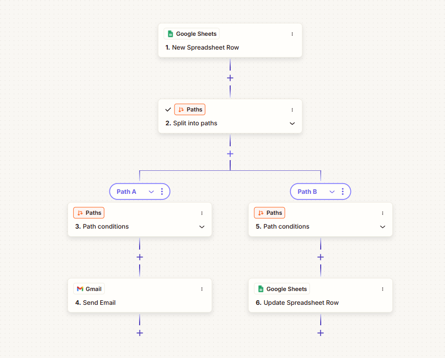
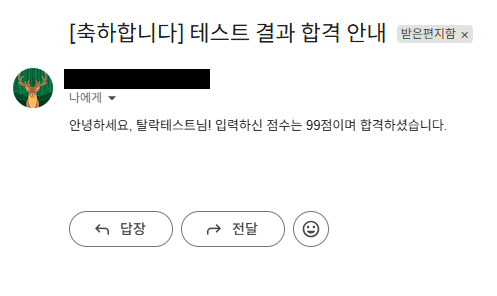
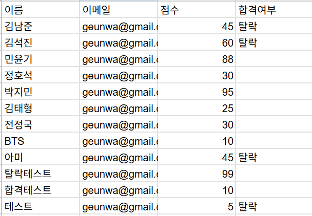
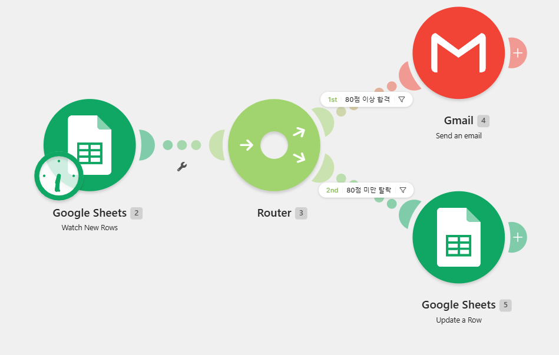
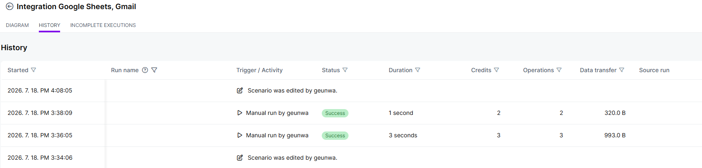
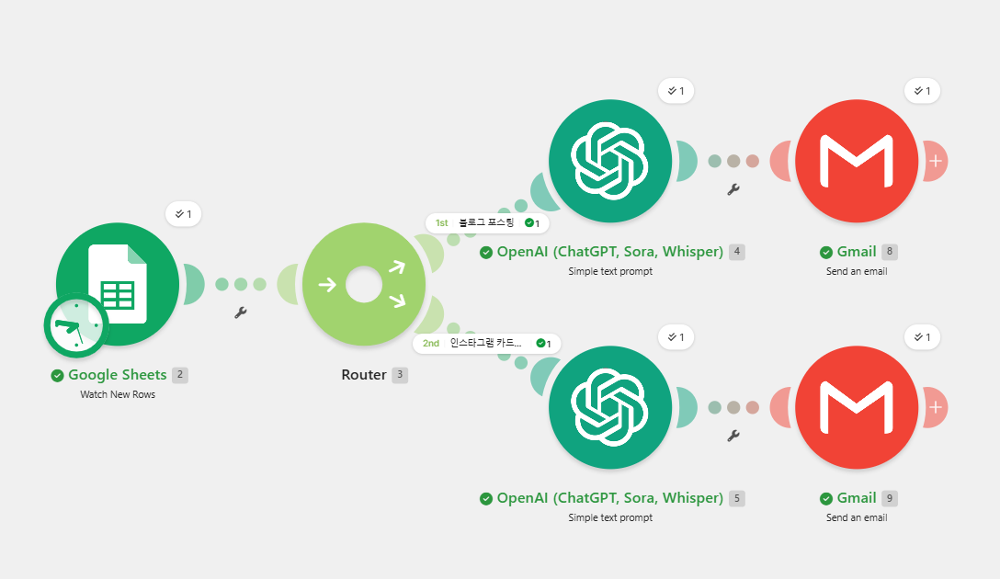
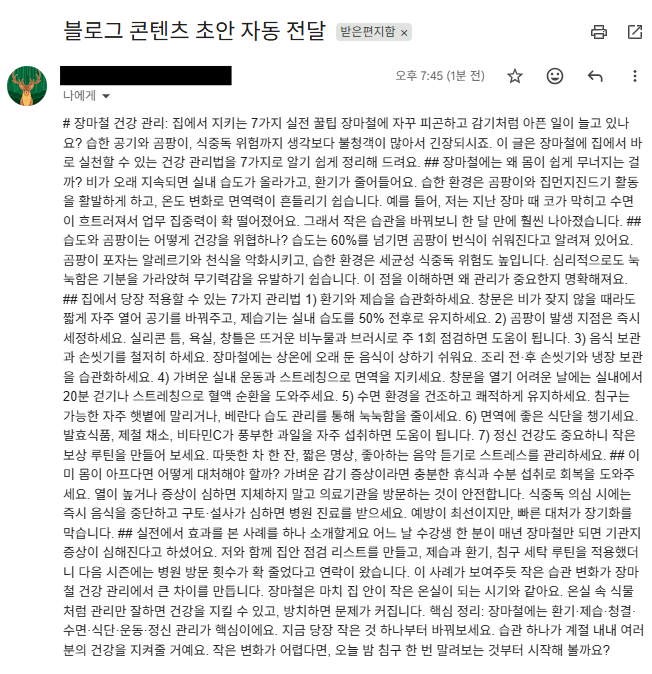
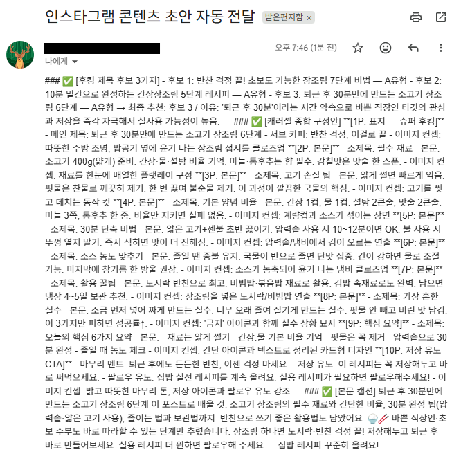

# 마케팅 자동화 파이프라인 구축 결과보고서

## 1\. \[프로젝트 1\] 조건 분기 자동화 (Zapier vs Make)

### ① 자동화 반복 업무 정의

* **업무 정의:** 구글 스프레드시트에 테스트 대상자의 성적 데이터가 입력되면, 점수 기준에 따라 합격자에게는 안내 이메일을 자동 발송하고, 탈락자는 시트에 자동으로 기록을 업데이트하는 조건 분기 시스템 구축

### ② 도구 선정 및 비교

* 동일한 워크플로우를 Zapier와 Make 두 가지 플랫폼에서 각각 구현하여 인터페이스의 직관성, 라우팅 조건 설정의 편의성, 실행 효율성을 비교·검증

| 비교 항목 | Zapier | Make |
| ----- | ----- | ----- |
| **분기 처리 방식** | Paths 기능을 활용한 하향식 트리 구조 | Router 노드를 중심의 방사형 허브 구조 |
| **시각적 직관성** | 단계별 스크롤 방식 (전체 흐름을 한눈에 파악하기 다소 복잡) | 2D 캔버스 기반 (데이터의 흐름과 통과 여부를 직관적으로 확인 가능) |
| **조건 설정 편의성** | 상위 노드의 필드 매핑이 정형화되어 있어 안정적 | 노드 간 변수 드래그 앤 드롭 및 실시간 필터 갱신 기능 제공 |

### ③ 워크플로우 설계 및 실행 결과

#### \[Zapier 구현\]

* **구조:** Google Sheets 트리거 ➔ Paths 분기 (Path A: 합격자 Gmail 발송 / Path B: 탈락자 시트 업데이트)

* **실행 결과:** 데이터 조건에 맞게 합격자 이메일 전송 및 시트 내 '탈락' 여부가 실시간으로 정상 업데이트됨을 확인함.

---

#### \[Make 구현\]

* **구조:** Google Sheets (Watch New Rows) 트리거 ➔ Router (80점 이상 합격 / 80점 미만 탈락) ➔ Gmail 발송 및 Sheets 행 업데이트

* **실행 내역 검증:** 실행 기록 분석 결과, 시나리오 수정 및 테스트 단계에서 유실 없이 100% 완료 상태를 기록하며 안정적인 연동을 입증함.

---

## 2\. \[프로젝트 2\] 자유 주제 자동화 설계 및 구현 (콘텐츠 최적화 파이프라인)

### ① 자동화할 반복 업무 정의

* **업무 정의:** 구글 시트에 마케팅 주제와 희망 채널을 입력하면, AI가 타깃 지향적이고 매력적인 브랜드 스토리텔러로 빙의하여 네이버 블로그 맞춤형 원고 또는 인스타그램 캐러셀 카드뉴스 기획안을 단 한 번에 자동 생성한 후 본인 Gmail로 즉시 전송하는 시스템

### ② 도구 선정 및 선정 이유

* **선정 도구:** **Make (메이크) & OpenAI (ChatGPT) & Gmail**  
* **선정 이유:**  
  * Make의 라우터 필터 기능을 통해 단 하나의 시트 안에서 블로그와 인스타그램의 타깃 특성에 맞는 개별 프롬프트 엔진을 조건별로 유연하게 제어하기 위함  
  * 복사 후 실무에 바로 사용할 수 있도록 가독성과 편집 효율성을 고려해 텍스트 출력을 이메일로 즉시 자동화함

### ③ 워크플로우 설계 문서 (흐름 설명)

1. **Trigger (구글 시트):** 새 행이 추가되면 입력된 주제 키워드와 채널 종류를 실시간 감지함.  
2. **Router (조건 필터 분기):**  
   * **1st 블로그 포스팅 경로:** 채널 종류가 '블로그'와 정확히 일치할 때 통과  
   * **2nd 인스타그램 카드뉴스 경로:** 채널 종류가 '인스타그램'와 정확히 일치할 때 통과  
3. **Action (AI 원고 생성 및 발송):**  
   * 각 경로에 내장된 맞춤형 프롬프트(되묻기 단계 배제, 모바일 줄바꿈 최적화, 후킹 제목 공식 내장)를 기반으로 OpenAI가 원고를 한 번에 연산한 후, 본인의 Gmail로 자동 전송함.

---

### ④ 채널별 최종 실행 결과 산출물

#### \[블로그 채널 테스트 결과\]

* **입력 주제:** 장마철 건강 관리  
* **출력 원고 파싱:** 인사말을 배제한 질문형 도입부 도입, 모바일 가독성 가이드라인(20\~35자 내외 줄바꿈), 실제 경험 사례 중심의 공감 스토리텔링이 완벽하게 가동된 마크다운 기반 원고가 전달됨.

#### \[인스타그램 채널 테스트 결과\]

* **입력 주제:** 소고기 장조림 (반려동물 장난감 추천 등 마케팅 키워드 호환)  
* **출력 원고 파싱:** 100가지 후킹 제목 라이브러리 중 최적 후보군을 선별(`퇴근 후 30분만에 만드는 소고기 장조림 6단계`)하고, 표지(1P)부터 요약(9P), 저장 유도 CTA(10P)까지 이미지 컨셉 가이드를 포함한 캐러셀 종합 구성안 및 피드 본문 캡션까지 완벽한 구조로 수신됨.

---

## 3\. 보안 및 과금 리스크 관리 서약

* **보안 준수:** 본 결과보고서에 첨부된 모든 캡션 및 스크린샷 내의 개인 구글 계정 주소, Gmail 수신자 메일, 스프레드시트 고유 키 값 및 API 인증 세부 정보는 마스킹 처리하여 외부 노출 위험을 사전에 차단하였습니다.  
* **과금 관리:** Make의 무료 계정 범위 및 OpenAI API 무료 테스트 크레딧 한도 내에서 완전하게 독립 작동하도록 엔지니어링하여 불필요한 자동 누적 과금 리스크를 원천적으로 방지하였습니다.

---

## 4. 보너스 과제 수행 여부 (가산점 항목)

### ① [보너스 1] 생성형 AI(OpenAI) 연동 자동화 성공
* 구글 시트의 키워드를 트리거로 받아 단순 복사가 아닌, OpenAI(ChatGPT) 액션을 결합하여 채널별 톤앤매너(블로그 코치 '나비', 인스타그램 '캐러셀 전략가')에 맞는 브랜드 스토리텔링 원고를 완전히 자동 생성하도록 파이프라인을 고도화함

### ② [보너스 2] 오류 대응 및 대체 경로(Gmail) 우회 전략 수립
* 구글 시트 업데이트 모듈의 데이터 매핑 및 행 번호(rowNumber) 바인딩 오류로 인한 데이터 유실 리스크를 감지한 후, 실행 실패 및 누수를 방지하기 위해 'Gmail 발송(Send an Email)' 액션으로 최종 결과물 전송 경로를 우회 설계함. 이를 통해 실행 결과물을 안전하게 메일함으로 증빙 및 적재하는 대체 경로 전략을 성공적으로 완수함
