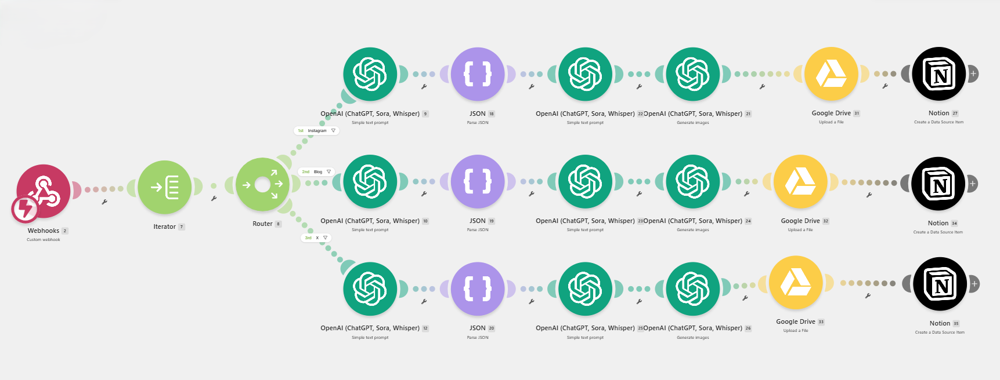
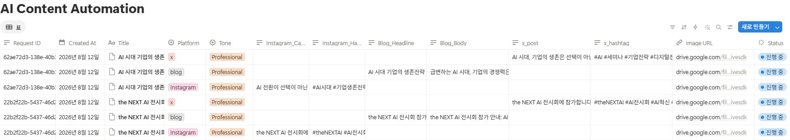

# AI 기반 소셜미디어 콘텐츠 자동 생성

> Make + OpenAI + Google Drive + Notion을 연동한 멀티플랫폼 콘텐츠 자동화 프로젝트

## 프로젝트 소개

사용자가 입력한 주제 또는 키워드를 **Custom Webhook**을 통해 Make로 전달하면, Instagram, Blog, X 플랫폼별 작업으로 자동 분기하여 각 플랫폼 특성에 맞는 텍스트 콘텐츠와 이미지를 생성하는 AI 기반 소셜미디어 콘텐츠 자동화 시스템입니다.

**OpenAI**를 활용해 플랫폼별 게시글 초안을 생성하고, 생성된 콘텐츠를 바탕으로 이미지 생성 프롬프트를 구성한 뒤 대표 이미지를 생성하도록 구현했습니다.

생성된 이미지는 **Google Drive**에 저장하고, 생성 결과와 관련 정보는 **Notion 데이터베이스**에 자동 기록하도록 구성했습니다.

이를 통해 콘텐츠의 **입력 → 생성 → 이미지 생성 → 저장 → 기록**까지의 반복 작업을 하나의 자동화 Workflow로 연결했습니다.

---

## 주요 기능

* **Custom Webhook 기반 입력 수신**

  * 주제, 키워드, 플랫폼, 톤 등의 요청 데이터 수신
* **플랫폼별 자동 분기**

  * Instagram
  * Blog
  * X
* **AI 텍스트 콘텐츠 생성**

  * OpenAI를 활용한 플랫폼별 게시글 생성
* **AI 이미지 생성 프롬프트 생성**

  * 생성된 콘텐츠와 핵심 키워드를 바탕으로 이미지 생성 프롬프트 구성
* **AI 이미지 생성**

  * OpenAI를 활용한 플랫폼별 대표 이미지 생성
* **Google Drive 저장**

  * 생성된 이미지 자동 저장
* **Notion 데이터베이스 기록**

  * 생성 콘텐츠, 이미지 링크, 요청 정보 등의 결과 기록

---

## 자동화 Workflow

사용자 입력
↓
Custom Webhook
↓
Make
↓
입력 데이터 정리 및 플랫폼 분기
├── Instagram → 텍스트 생성 → 이미지 프롬프트 → 이미지 생성
├── Blog → 텍스트 생성 → 이미지 프롬프트 → 이미지 생성
└── X → 텍스트 생성 → 이미지 프롬프트 → 이미지 생성
↓
Google Drive 저장
↓
Notion 데이터베이스 기록

### 전체 처리 과정

1. 사용자가 주제, 키워드, 플랫폼, 톤 등의 정보를 입력합니다.
2. Custom Webhook이 요청 데이터를 수신합니다.
3. Make에서 입력 데이터를 정리하고 선택된 플랫폼에 따라 생성 흐름을 분기합니다.
4. OpenAI를 활용해 플랫폼별 텍스트 콘텐츠를 생성합니다.
5. 생성된 콘텐츠와 핵심 키워드를 바탕으로 이미지 생성 프롬프트를 구성합니다.
6. OpenAI를 활용해 플랫폼별 대표 이미지를 생성합니다.
7. 생성된 이미지를 Google Drive에 저장합니다.
8. 텍스트 결과, 이미지 링크, 요청 정보 등을 Notion 데이터베이스에 기록합니다.

---

## 사용 기술

| 기술 / 도구            | 역할                                 |
| ------------------ | ---------------------------------- |
| **Make**           | 전체 자동화 Workflow 구성                 |
| **Custom Webhook** | 외부 입력 데이터 수신                       |
| **OpenAI**         | 텍스트 콘텐츠 생성, 이미지 생성 프롬프트 생성, 이미지 생성 |
| **Google Drive**   | 생성 이미지 저장                          |
| **Notion**         | 생성 결과 데이터베이스 및 산출물 관리              |

---

## 플랫폼별 콘텐츠

| 플랫폼       | 텍스트 결과         | 이미지 규격            |
| --------- | -------------- | ----------------- |
| Instagram | 캡션 + 해시태그      | 4:5 / 1080 × 1350 |
| Blog      | 제목 + 본문        | 16:9 / 1200 × 675 |
| X         | 단문형 게시글 + 해시태그 | 16:9 / 1200 × 675 |

### Instagram

* 캡션 + 해시태그
* 4:5 portrait
* 1080 × 1350
* aesthetic / polished / premium social-media mood

### Blog

* 제목 + 본문
* 16:9 landscape
* 1200 × 675
* informative / sophisticated / polished / professional visual mood

### X

* 단문형 게시글 + 해시태그
* 280자 이내
* 16:9 landscape
* 1200 × 675
* modern / sharp / sophisticated / premium social-media mood

---

## 프롬프트 설계

본 프로젝트의 프롬프트는 초기 설계안과 실제 Make 적용본을 구분하여 개발했습니다.

### 설계 방향

* 동일한 주제를 여러 플랫폼에 맞게 확장
* 플랫폼별 콘텐츠 소비 방식에 맞춘 표현 차별화
* 입력되지 않은 사실의 임의 생성 방지
* Make의 JSON 파싱 및 모듈 간 데이터 연결 안정성 확보

### 텍스트 프롬프트

실제 Make 환경에서는 JSON 파싱 안정성과 후속 모듈 연결을 고려하여 플랫폼별 출력 구조를 단순화했습니다.

Instagram:

```json
{
  "platform": "Instagram",
  "caption": "string",
  "hashtags": "string"
}
```

Blog:

```json
{
  "platform": "Blog",
  "headline": "string",
  "body": "string"
}
```

X:

```json
{
  "platform": "X",
  "x_post": "string",
  "hashtags": "string"
}
```

### 이미지 생성 프롬프트

이미지는 플랫폼별 비율, 무드, 장면 구성 등이 결과 품질에 직접적인 영향을 주기 때문에 상세한 구조를 유지했습니다.

```json
{
  "platform": "string",
  "visual_concept": "string",
  "image_prompt": "string",
  "style_keywords": ["string", "string", "string"],
  "aspect_ratio": "string",
  "image_size": "string",
  "negative_prompt": "string",
  "reason": "string"
}
```

### 프롬프트 개선 방향

초기 설계안은 플랫폼별 콘텐츠 품질을 높이는 데 초점을 맞추고, 실제 구현 단계에서는 자동화 안정성을 중심으로 조정했습니다.

* 텍스트: 상세 규칙 → 간소화된 JSON 구조
* 이미지: 플랫폼별 상세 시각 지시 유지
* 모듈 간 데이터 전달 구조 단순화
* 출력 편차 및 예외 상황 최소화

---

## 이미지 생성 원칙

* 이미지 생성 AI에 전달할 프롬프트 생성
* 모든 프롬프트 및 JSON 값은 영어 기준
* 텍스트 오버레이 최소화
* 제목, 문장, 숫자, 해시태그, 로고, 워터마크 삽입 방지
* `text`, `typography`, `letters`, `words` 등을 negative prompt에 포함
* 불필요한 오브젝트와 복잡한 배경 최소화
* generic stock photo처럼 보이지 않도록 구체적인 시각 요소 구성

---

## 결과 산출물

동일한 행사 정보인 **「AI 시대 기업의 생존전략 세미나 참가 안내」**를 기반으로 Instagram, Blog, X에 적합한 형태의 콘텐츠를 생성했습니다.

### Instagram

* 캡션 1종
* 해시태그 15개
* 프로페셔널 문체
* 문제 제기형 도입 → 핵심 내용 → 참여 유도 구조

### Blog

* 제목: **AI 시대 기업의 생존전략 세미나 참가 안내**
* 장문형 행사 안내 글
* 공백 포함 1,182자
* 공백 제외 882자
* 500자 이상 조건 충족

### X

* 단문형 홍보 게시글
* 공백 포함 167자
* 공백 제외 126자
* 해시태그 포함 최종 208자
* 280자 이내 조건 충족

---

## 결과 검증

| 검증 항목             | 결과       |
| ----------------- | -------- |
| Instagram 캡션 생성   | 확인       |
| Instagram 해시태그 생성 | 확인 — 15개 |
| Blog 본문 500자 이상   | 충족       |
| X 280자 이내         | 충족       |
| 대표 이미지 생성         | 확인       |
| Notion 저장 연계      | 확인       |

---

## 저장 및 관리

생성된 이미지는 **Google Drive**에 저장하고, 생성된 텍스트 결과와 이미지 링크 등의 정보는 **Notion 데이터베이스**에 기록하도록 구성했습니다.

이를 통해 생성 결과를 누적 관리하고, 팀원 간 공유 및 검토가 가능하도록 구성했습니다.

---

## 기대효과

### 1. 콘텐츠 제작 효율화

동일한 주제를 여러 플랫폼에 맞게 각각 작성하고 저장해야 하는 반복 작업을 줄일 수 있습니다.

### 2. 멀티플랫폼 대응

Instagram, Blog, X 등 플랫폼별 형식에 맞는 콘텐츠 초안을 자동으로 확보할 수 있습니다.

### 3. 결과물 관리

생성 결과를 Google Drive와 Notion에 기록하여 이전 작업을 확인하고 재활용할 수 있습니다.

### 4. 협업 지원

생성 결과를 공유 가능한 형태로 관리하여 팀 프로젝트의 검토와 피드백에 활용할 수 있습니다.

### 5. 확장 가능성

향후 다른 SNS 및 홍보 채널을 추가하거나 프롬프트, 저장 항목, 승인 절차 등을 확장할 수 있습니다.

---

## 활용 방안

* **소규모 브랜드 및 1인 운영자**: SNS 게시물 초안 자동 생성
* **마케팅·홍보 담당자**: 멀티채널 콘텐츠 제작 보조
* **행사·전시 운영팀**: 홍보 문구 및 이미지 제작 지원
* **교육 및 팀 프로젝트**: AI 자동화 Workflow 학습 사례
* **콘텐츠 운영 조직**: 결과물 기록 및 재활용 기반 구축

---

## 팀 역할

| 팀원      | 담당 업무                                                                    |
| ------- | ------------------------------------------------------------------------ |
| **박경부** | 프로젝트 초기 기획 및 총괄, 초기 제목 작성, Notion 데이터베이스 자료 축적                           |
| **조근화** | 플랫폼별 프롬프트 설계·수정·보완, Make 자동화 구성 및 구현, Notion 문서 구조 및 내용 정리·완성, 자동화 결과 검토 |
| **박채원** | 자동화 구현 관련 학습                                                             |
| **김재남** | 프로젝트 초기 보고서 초안 작성 참여 후 개인 사정으로 참여 중단                                     |

> 프로젝트 초기 자료와 제목 작성 및 Notion 데이터베이스 자료 축적은 박경부가 담당했으며, 이후 프롬프트와 Notion 문서를 현재의 형태로 정리하고 완성한 작업과 Make 자동화 구성 및 구현은 조근화가 담당했습니다.

---

## 프로젝트 의의

본 프로젝트는 단순히 AI로 콘텐츠를 생성하는 데 그치지 않고,

**기획 → 입력 → 플랫폼 분기 → AI 콘텐츠 생성 → 이미지 생성 → Google Drive 저장 → Notion 기록**

으로 이어지는 반복적인 콘텐츠 제작 업무를 하나의 자동화 Workflow로 연결했다는 데 의미가 있습니다.

특히 초기 프롬프트 설계와 실제 Make 적용 과정에서 콘텐츠 품질과 자동화 안정성을 함께 고려하고, 실제 운영 환경에 맞게 프롬프트와 데이터 구조를 조정했습니다.

이를 통해 AI와 자동화 도구를 결합한 실무형 콘텐츠 제작 Workflow를 설계하고 구현했습니다.

---

## Screenshots

### Make Workflow



### Notion Database



### Generated Image


---

## Repository 구조

```text
/
├── README.md
└── images/
    ├── 01-make-workflow.png
    ├── 02-notion-database.png
    └── 03-generated-image.png
```
